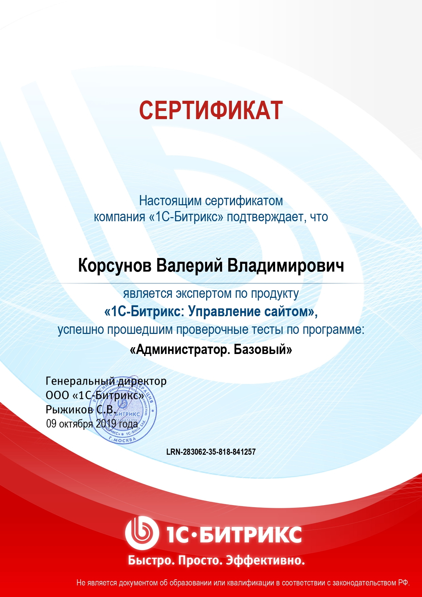

# web программист

Знание  web-технологии: PHP, MySQL, HTML, CSS, JavaScript.

Администрирование Bitrix на centOS

| Мои сертификаты | |
| ---- | ---- |
| <a href="certificates/adminBase.pdf">Администратор.Базовый</a> |  |

# Битрикс 

## Интеграция верстки

* [Московское Долголетие](mos-dolgoletie/index.md) (код в репозитории заказчика)
* [АллАрт сервис]([mos-dolgoletie/index.md](https://allart-service.ru)) 
* [youconsult.ru](https://youconsult.ru/) , [youconsult.eu](https://youconsult.eu/) (код в репозитории заказчика)
* [kopak.ru](https://kopak.ru) (код в репозитории заказчика)
* [findiplomat.ru](https://findiplomat.ru/) (код в репозитории заказчика)
* [firstmos.ru](https://firstmos.ru/) (код в репозитории заказчика)
* [zelsan.ru ](http://zelsan.ru/) (код в репозитории заказчика)
* [medikomed.ru](http://medikomed.ru/) (код в репозитории заказчика)
* [magiavkusa.ru](https://magiavkusa.ru/) (код в репозитории заказчика)
* [centrzaboty.ru](https://centrzaboty.ru/) (код в репозитории заказчика)
* [mals](mals/initial.md) (код в репозитории заказчика)

Участие в стартап проекте: [jam-track.com](https://jam-track.com)

## Мои компоненты 

* [feedback](https://github.com/valeriykorsunov/feedback_kvv) 

 

