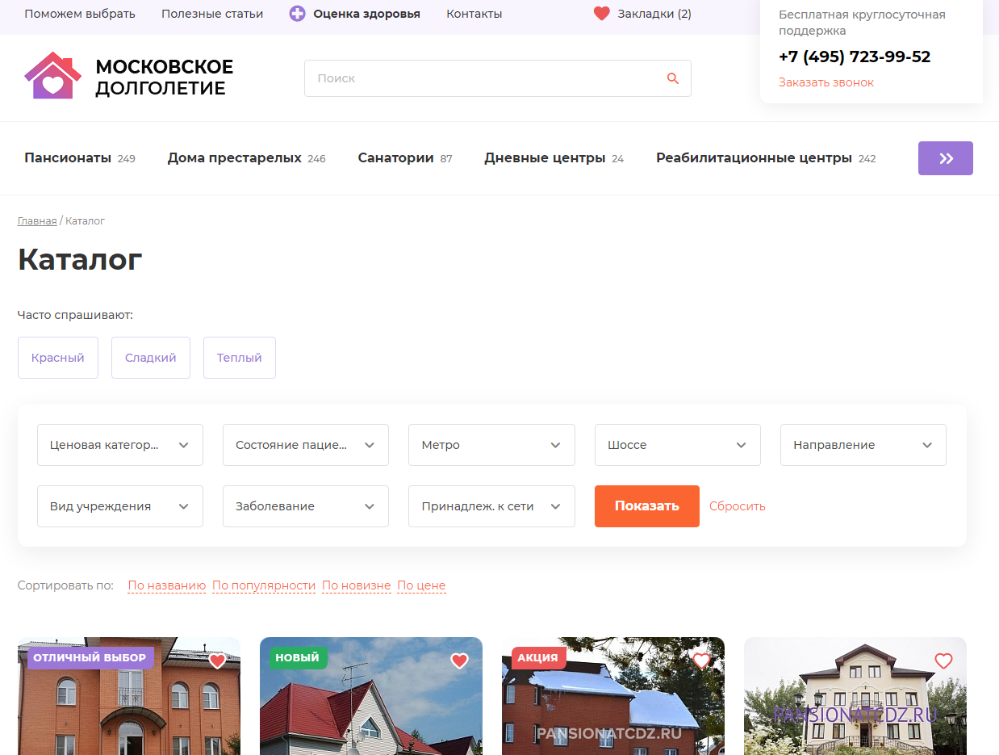
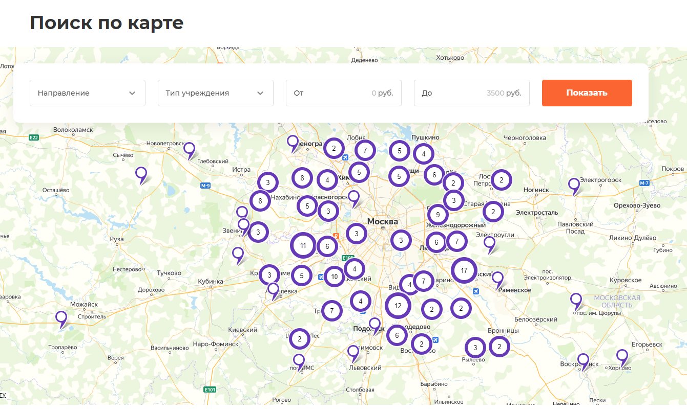

# Московское долголетие

Ссылка на проект: https://mos-dolgoletie.ru/

Я выполнил интеграцию готовой верстки на Битрикс Старт.

Практически весь контент подключен с использованием компонент и включаемых областей, весь контент можно редактировать из визуальной часть сайта. 

Можно выделить каталог с умным фильтром, тегами и сортировкой, а также карту с гео точками из БД и фильтром по ним.

На сайте реализованы 4 формы обратной связи с отправкой без перезагрузки.

Выполнены seo доработки для каталога. 

